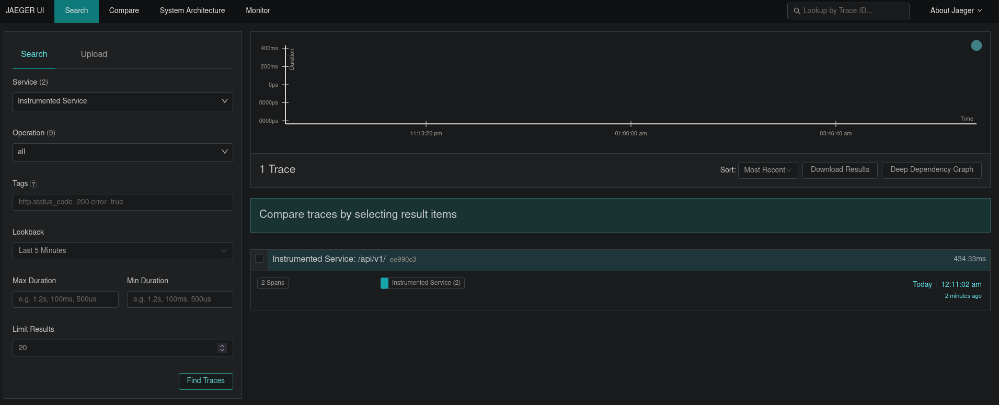

# Instrumented example

This example shows an API exporting traces to a compatible OTLP Exporter

## Usage

Start an OTLP Exporter. Here, we'll start Jaeger all in one: 

```
$ docker run -d --name jaeger \
    -e COLLECTOR_OTLP_ENABLED=true \
    -p 4317:4317 \
    -p 16686:16686 \
  jaegertracing/all-in-one
```

Start the example API

```
$ go run main.go start
```

Generate some traffic on `localhost:8000/api/v1/`

```
$ curl http://localhost:8080/api/v1/
{"message":"Worked 433 ms"}
```

You should now be able to access Traces in Jaeger UI at `http://localhost:16686`


